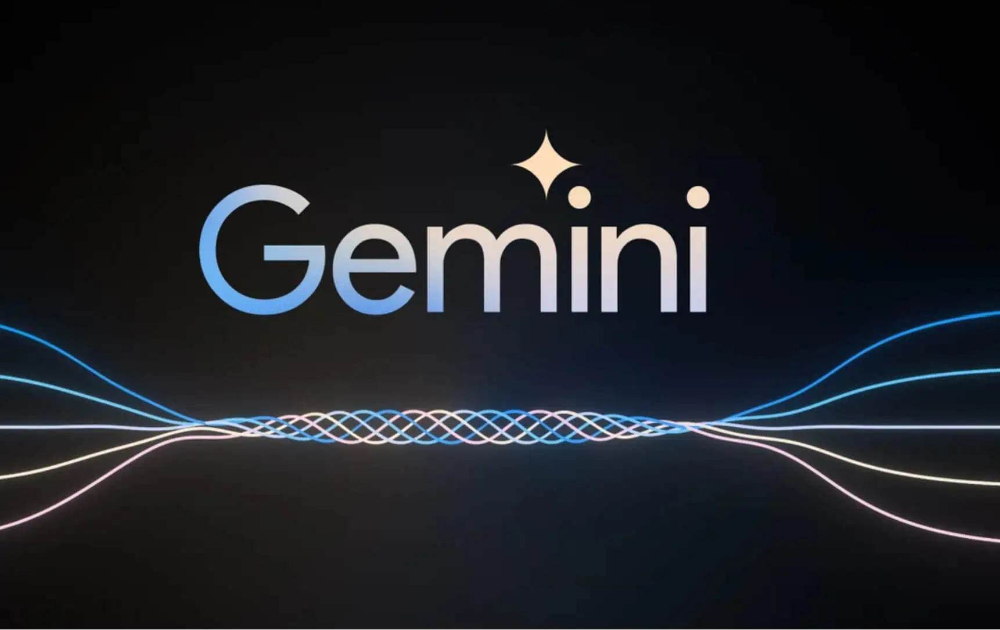

# Comic-cult

## redbull gives you wings 💸we give you comic 🖼️


## Table of Contents

1. [Project Description](#project-description)
2. [Demo](#demo)
3. [Features](#features)
4. [Design Links](#design-links)
5. [Challenges Faced](#challenges-faced)
6. [Tech Stack](#tech-stack)
7. [Setup Guide](#setup-guide)
8. [How to Contribute](#how-to-contribute)
9. [Additional Information](#additional-information)


## ℹ️ Project description

Transform your stories into captivating comic art with dialogue effortlessly! Our project harnesses the power of GemeiAI and stable diffusion for processing and generating stunning images and dialogues. Utilizing feature flags, you can seamlessly toggle environment variables on and off as needed. The final masterpiece is delivered straight to your inbox as a beautifully crafted comic PDF. Enjoy the magic of storytelling in a whole new visual dimension! 📧💬🖼️

</div>

## Demo 💻

https://github.com/Girishbari/comic-cult/assets/38005544/f264d59a-5e9b-46dc-8c3d-0c138cc11de1

## ⚒️ Features:

<table>
    <tr>
      <th></th>
      <th>Feature Name</th>
      <th>Feature Description</th>
    </tr>
    <tr>
      <td></td>
      <td>Dialogue Generation</td>
      <td>With advanced dialogue generation capabilities, your characters come to life on the comic pages. Using sophisticated summary, gemeni generates natural and dynamic dialogues that complement the visuals, enhancing the overall storytelling experience.</td>
    </tr>
    <tr>
      <td></td>
      <td>Comic Art Generation</td>
      <td>: Leveraging stability AI and DreamStudio API keys, Comic Art Generation process is infused with stability and creativity. Stability AI ensures consistent and reliable image processing, while DreamStudio API keys unlock a world of artistic possibilities, allowing us to create captivating comic art with ease.</td>
    </tr>
    <tr>
      <td></td>
      <td>Flagsmith Feature Flags Integration</td>
      <td>I've implemented  flagsmith feature flags into our project, providing you with ultimate control over its functionalities. Whether you need to toggle specific features on or off, our feature flags make it effortless to customize the comic generation process according to your preferences and requirements.</td>
    </tr>
      <tr>
      <td></td>
      <td>Email Delivery of Comic PDF:</td>
      <td>Seamlessly integrating nodemailer into our workflow, I've streamlined the process of delivering your comic PDF straight to your inbox. Nodemailer provides a robust and reliable solution for sending emails programmatically, ensuring that your comic masterpiece reaches its destination efficiently and securely.</td>
    </tr>
        
</table>

##🎨✍✨ Design Links
<table>
    <tr>
        <th>Design</th>
        <th>Link</th>
    </tr>
    <tr>
        <td>Design 1</td>
        <td><a href="https://www.figma.com/design/noJe9ZZ2f3QUtF16Z8eErG/Untitled?node-id=0-1&t=SoiQ7EEFy9ART5JZ-1">Link to Design 1</a></td>
    </tr>
</table>

## 🤔 What challenges I ran into

<table>
    <tr>
      <td>Comic Art generation</td>
      <td>I wanted to make something that is of fun and also gives me a lot of learning I used apis of openAi even utilized the langchain for some instances but wanted to take my level above, I wanted to play around with images that directed me of using any stable diffusion model (which I had no Idea how to use) I tried running model locally also used google collab however all these things made me more perplexed at the end I was in the need of some Stable diffusion API and key which dream-studio and Stability AI provided</td>
    </tr>
    <tr>
      <td>Workflow/pipeline of making</td>
      <td>Probably I worked for this part mostly such a pipeline was the backbone of this project, I was too confused and wanted to leave project for once however, I slowly worked of making a streamlined flow of generating dialogues (gemini helped) and then getting images(Stability API helped) based on that dialogue, adding dialogues onto images(Canvas helped), all these steps I wanted to be reliable and smooth which could provide happy user experience </td>
    </tr>
    <tr>
      <td>Using promises</td>
      <td>I have only heard and learned about promises and never utilized them in my any of the project until now, oh man they were life saver, they helped me in making and flow better and workable, I literally now want to use promises everywhere, I really got the understand of promises, async await, .then and catch</td>
    </tr>
      <tr>
      <td>failure of express func and integration of nodemailer</td>
      <td>I am using express for my backend to serve front of various routes I never thought that res.sendfile, res.download would be so pathetic to use, they are made to sendfile from backend to frontend and guess what they were giving errors for the same, almost at this point also I am thinking to use them but they were so un-useful but then nodemailer came, I had this thought in back of my mind that if express functions does not work I will try sending pdf to user mail and using nodemailer this was so useful that I never imagined basically in few minutes I did this </td>
    </tr>
        
</table>

## 💻 Tech Stack

- [Next.js](https://nextjs.org) - Next.js is an open-source web development framework.
- [TypeScript](https://www.typescriptlang.org) - TypeScript is a free and open-source high-level programming language.
- [Tailwind CSS](https://tailwindcss.com) - Tailwind CSS is a utility-first CSS framework for rapidly building modern websites without ever leaving your HTML.
- [Daisy UI](https://tailwindcss.com) - It has inbuilt tailwind component which can be used
- [Express](https://tailwindcss.com) - It is use to make server endpoint and serve front end as needed
- [flagsmith](https://tailwindcss.com) - Manage feature flags across web, mobile, and server side applications
- [Gemini AI](https://tailwindcss.com) - It has api which could be use ful to make prompt and get output
- [Nodemailer](https://tailwindcss.com) - Used to send mail or attachment programmatically
- [Turborepo](https://turbo.build/) - Incremental build system used for building monorepo projects

# Setup Guide ✨

Welcome to the **Comic Cult** project! Follow these steps to set up and run the project on your local machine.

## Prerequisites 🛠️

Before you begin, ensure you have the following installed:

- **Node.js** (v14 or higher)
- **npm** (v6 or higher)

## Installation Steps 🚀

1. **Clone the repository:**

    ```sh
    git clone https://github.com/Girishbari/comic-cult.git
    ```

2. **Navigate to the project directory:**

    ```sh
    cd comic-cult
    ```

3. **Install all dependencies:**

    ```sh
    npm install
    ```

4. **Install Turbo globally (if not already installed):**

    ```sh
    npm install turbo --global
    ```

## Configuration ⚙️

Before running the project, you may need to configure certain environment variables or settings. These configurations are typically found in `.env` files within specific directories. Ensure that you review and update these configurations according to your environment.

## Running the Project ▶️

To run the entire project, execute the following command:

```sh
turbo dev
```

This will start both the client and server components.

## Running Individual Components 🧩

If you prefer to run individual components separately, follow these steps:

### Run the Server Only 🌐

Navigate to the server directory and start the server:

```sh
cd apps/server && npm run dev
```

### Run the Client Only 💻

Navigate to the client directory and start the client:

```sh
cd apps/client && npm run dev
```

## Troubleshooting 🛠️

If you encounter any issues during setup or while running the project, refer to the project's issue tracker on GitHub or search for solutions online. Common issues and their resolutions may also be documented in the project's README or other documentation files.

## Additional Information 📚

For more detailed information about the project and its components, refer to the project's main documentation.


<!-- ## 🔨 Locally install

To run this project, you will need to add the following environment variables to your .env file (use .env.example for reference)

<table>
    <tr><td>[Gemini AI]</td> <td>https://ai.google.dev/docs </td> </tr>
     <tr><td>[Dream Studio]</td> <td>https://dreamstudio.ai/ </td> </tr>
      <tr><td>[Nodemailer]</td> <td> https://stackoverflow.com/questions/45478293/username-and-password-not-accepted-when-using-nodemailer</td> </tr>
</table> -->

## 🤔 How to contribute ?

Contributing to open-source software (OSS) projects can be a rewarding and fulfilling experience. Not only can you learn new skills, but you can also help make a valuable contribution to a project that benefits the broader community

- Remember to read [Code of Conduct](CODE_OF_CONDUCT.md) before contributing.

- Read the [Git Workflow](docs/git.md) to follow best practices.

- Follow the [Contribution Guidelines](CONTRIBUTING.md).

- Create an [issue](https://github.com/Girishbari/comic-cult/issues) to report bugs, and vulnerabilities or add a new feature.

- Remember to add a good commit message.

- Don't spam if you do it your PR/issue will be closed.
